### Introducción

Este proyecto tiene como objetivo desarrollar un sistema de información completo, desde el análisis hasta la implementación, para [Describir brevemente el caso de la empresa o problema a resolver].

### Estructura del Proyecto

El proyecto se encuentra dividido en cuatro entregas principales:

* **TP1: Análisis y Diseño:** Se realiza el análisis inicial del sistema, incluyendo diagramas de casos de uso, colaboración, estado y clases.
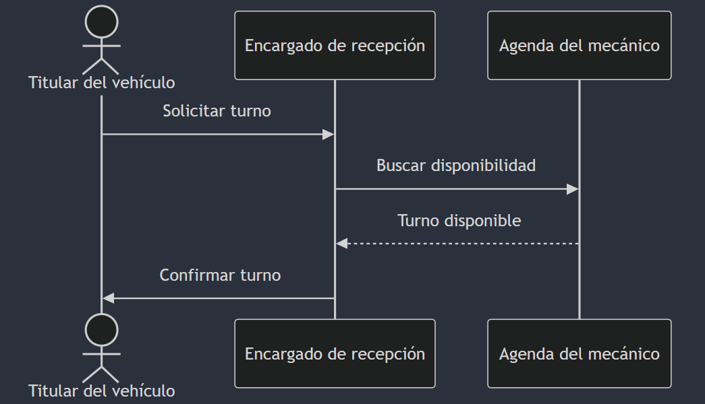
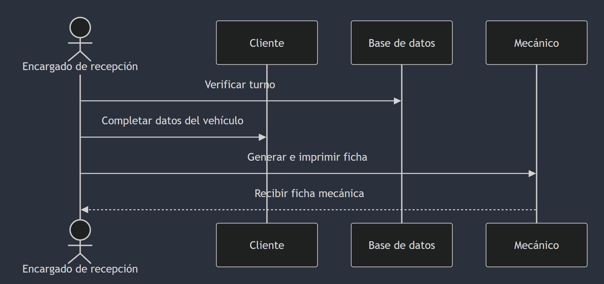
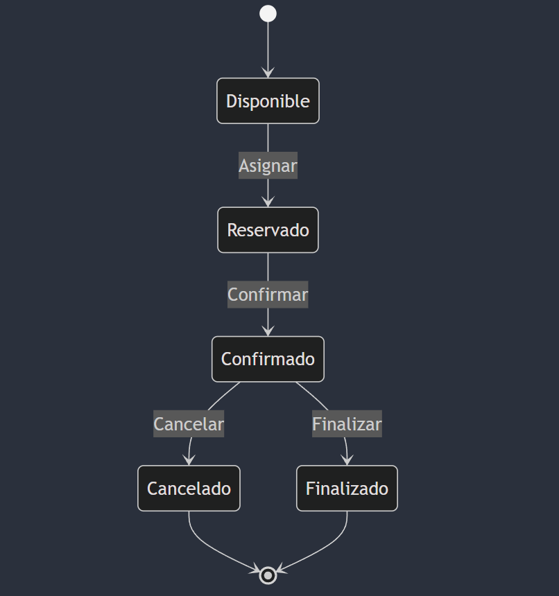
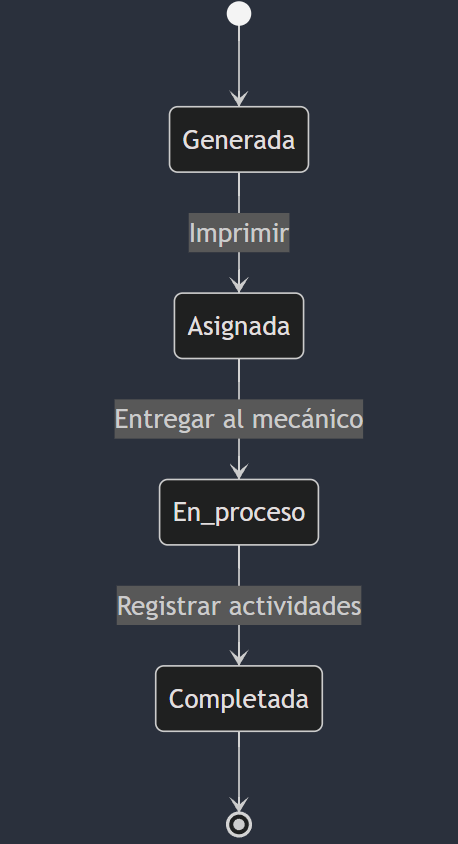
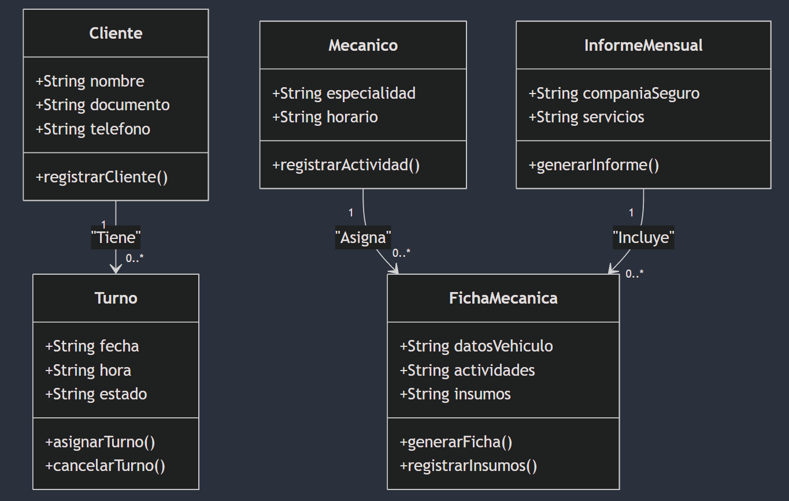
* **TP2: Diseño de Interfaz:** Se diseñan los prototipos de interfaz utilizando JavaFX y se crea un diagrama de navegación con maven.
  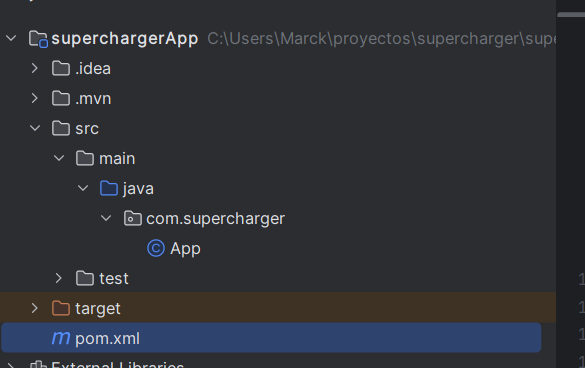
* **TP3: Aplicación de Patrones:** Se aplican patrones arquitectónicos (MVC, DAO) y de diseño (Singleton, Factory, etc.) para mejorar la estructura y modularidad del sistema.
  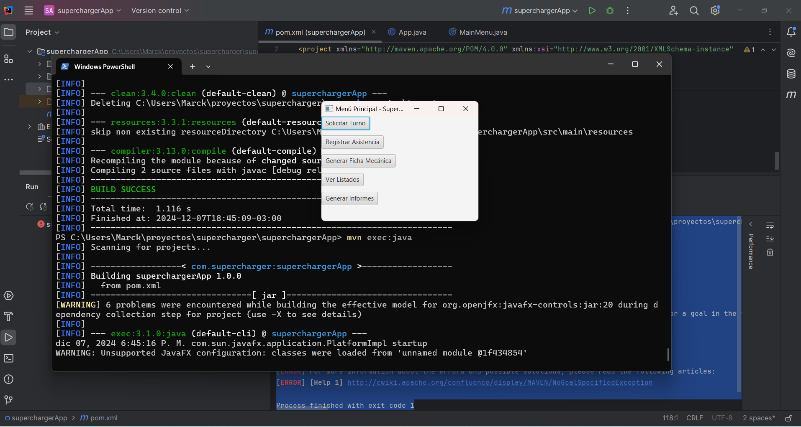
  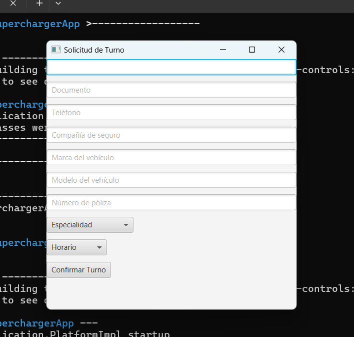
  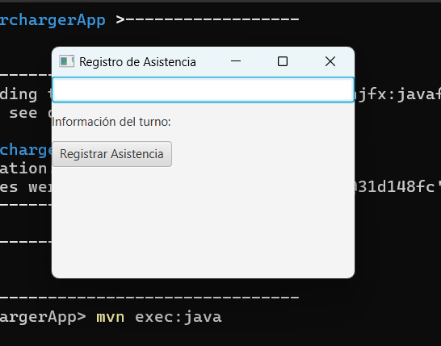
  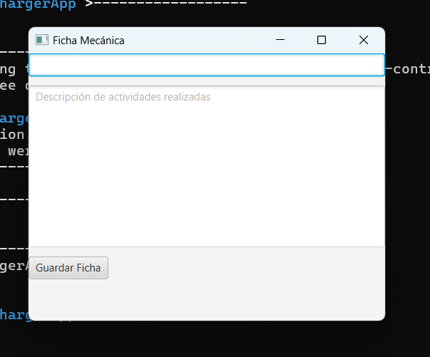
  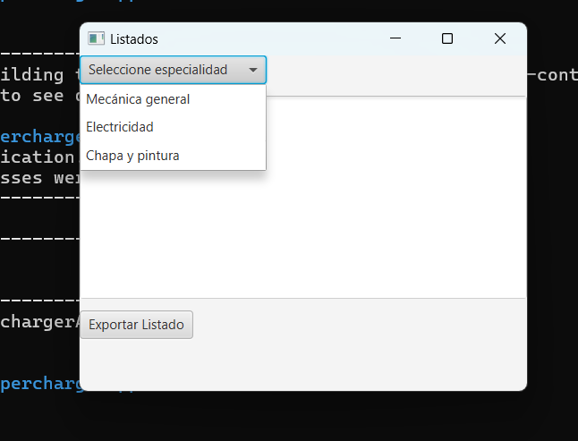
  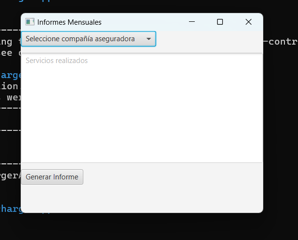
  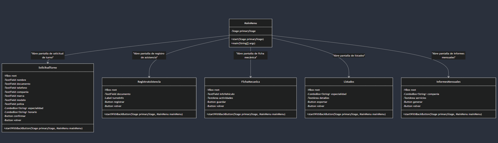

* **TP4: Implementación ORM y Testing:** Se implementa el mapeo objeto-relacional utilizando una herramienta ORM para Java (especificar cuál) y se realizan pruebas unitarias y funcionales.

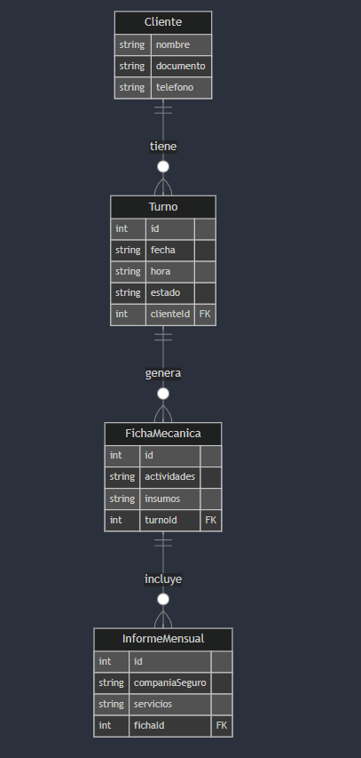
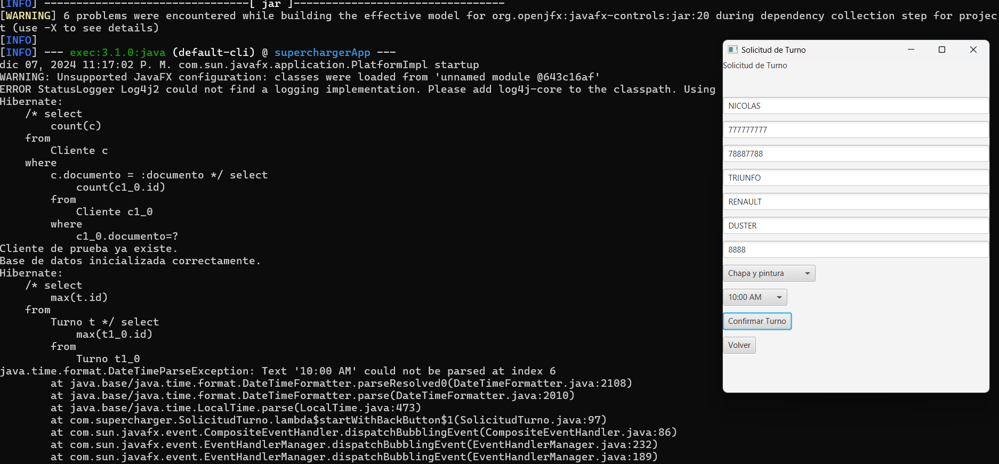
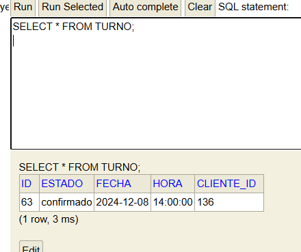

### Herramientas Utilizadas

* **Lenguaje de Programación:** Java
* **IDE:** IntelliJ IDEA
* **Gestión de Dependencias:** Maven
* **Diagramación:** Mermaid (para diagramas UML)
* **ORM:** [Especificar la herramienta ORM utilizada, ej: Hibernate, JPA]
* **Librería Gráfica:** JavaFX


### OBTENER PROYECTO FINAL

1. **Clonar el repositorio:**
   ```bash
   git clone https://github.com/Marcktm/sistemaDeInformacion.git
